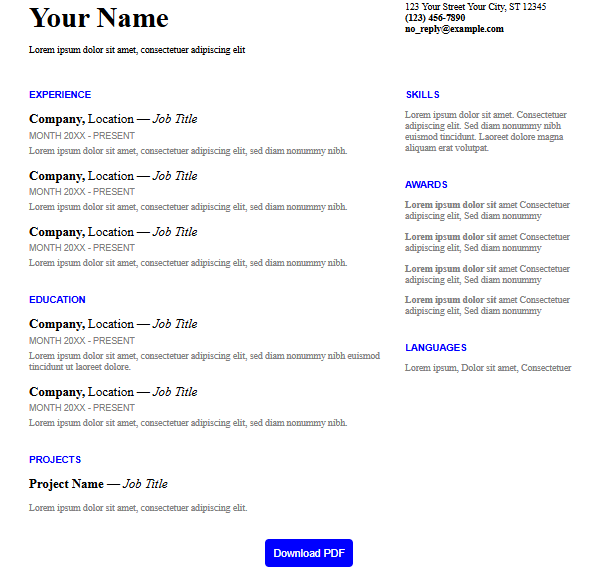

# 📝 Single-paged Resume PDF

💡 `Inspiration`: A ***Google docs resume template*** inspired that is interactive, downloadable resume built with HTML, CSS, and `html2pdf.js`.  

## 📌 Features

- Clean and modern responsive layout
- Downloadable PDF version
- Easy to customize for your own needs
- Simple HTML/CSS/JS – no frameworks required

## 📸 Preview

 <!-- Replace with an actual screenshot if available -->

## 🚀 Live Demo

👉 [View Live Resume](https://ptrcmahinay.github.io/single-paged-resume-pdf/)  

## 🧰 Built With

- HTML5
- CSS3
- [html2pdf.js](https://github.com/eKoopmans/html2pdf)

## 📜 License

This project is licensed under the MIT License. See the [LICENSE](./LICENSE) file for details.

## 📄 How to Use

1. Clone this repository:
   ```bash
   git clone https://github.com/ptrcmahinay/single-paged-resume-pdf.git```

2. ✏️ Customize
   - Change personal info, experience, education, etc. inside index.html
   - Modify styles in resume.css
   - Update the email, phone, address, or even add your own sections!


***
#### 🔗 Connect with Me**
#### 💼 LinkedIn

📧 Email: ptrcmahinay.com
